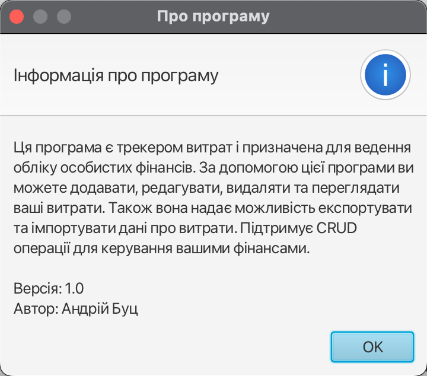

### Expenses Tracker

This project is an Expenses Tracker application developed in Java, aimed at helping users efficiently manage their expenses. It leverages PostgreSQL as its backend database, with support for asynchronous queries to enhance performance. Additionally, it offers convenient functionalities for importing and exporting expense data.

#### Installation

1. Clone the repository:
    ```bash
    git clone <repository_url>
    cd expenses-tracker
    ```

2. Set up your environment variables:
   Create a `.env` file in the project root directory and add the following:
    ```plaintext
    DB_PASSWORD=YOUR_PASWORD
    DB_URL=jdbc:postgresql://localhost:5432/postgres
    USER=postgres
    ```

3. Create the necessary database tables:
   Run the following commands using the provided Makefile:
    ```bash
    make create_table
    ```


3. Access the Expenses Tracker through your browser by navigating to `http://localhost:5000`.

#### Functionalities

- **Expense Tracking**: Record your expenses effortlessly by categorizing them and specifying relevant details such as  amount, and description.

- **Asynchronous Queries**: Utilizes asynchronous database queries to optimize performance, ensuring a seamless user experience even with large amounts of data.

- **Import and Export Data**: Easily import existing expense data from external sources or export your tracked expenses for backup or sharing purposes.

#### File Structure

- **migrations**: Contains SQL scripts for creating and dropping database tables.
    - `V1__Create_table.sql`: SQL script for creating the necessary database tables.
    - `V1__Drop_table.sql`: SQL script for dropping the database tables.

- **Makefile**: Includes commands for creating and dropping database tables.


### Screenshots

- Main window


- Add expenses window


- About window


#### Contributing

Contributions to this project are highly appreciated! Whether it's fixing bugs, adding new features, or improving documentation, feel free to contribute by opening an issue or submitting a pull request.

